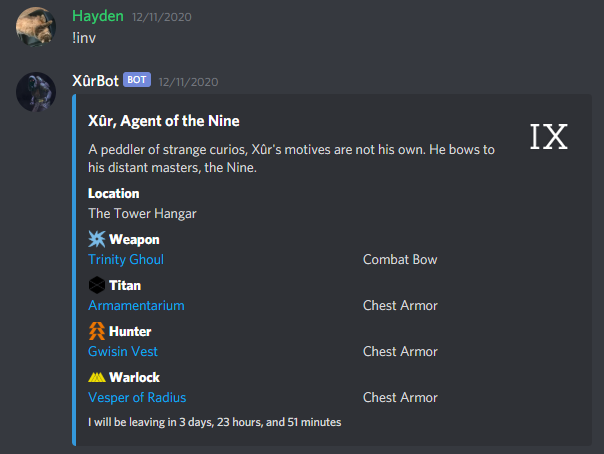

# Xûr Bot
Discord bot that tracks and displays [Xûr's](https://www.destinypedia.com/X%C3%BBr,_Agent_of_the_Nine) (Destiny 2) weekly rotating inventory using the [Bungie.NET API](https://bungie-net.github.io/).

## Commands
Currently, Xûr Bot only supports one command:
* ### !inv
    * ### Xur is available
      When a user sends the message **!inv** in the discord server Xûr Bot will respond to the user with an embedded message containing the current week's inventory with links to their corresponding to their appropriate [Destiny Tracker](https://destinytracker.com) page as well as his location:
        
       

    * ### Xur is not available
      In the event that Xûr is not available in-game when the command is called, Xûr Bot will send a message telling the user when he will be returning next:
        
      

## Events
* #### Who/What are the Nine?
    If a user sends a message asking who/what are the nine, Xûr Bot will respond with one of several in-game quotes:
      
    
* #### Who/What is Xur?
    If a user sends a message asking who/what is Xur, Xûr Bot will respond with one of several in-game quotes:
      
    
  
* #### Profanity
  * #### General Profanity
    If a user sends a message containing profane language, it will respond with one of several in-game quotes:
      
    
  * #### Profanity directed at Xûr Bot
    If a user sends a message containing profane language directed at Xûr Bot, it will respond with one of several in-game quotes and react the message with a thumbs-down emoji:
      
    
  * #### Hate Speech
    In the event that Xûr Bot detects a user has sent a message containing hate speech in the server, he will simply delete the message.
* #### Unhandled Message
    If Xûr Bot reads a message that should be understood, but causes an error, the server, channel, author, and message contents will be logged in the err.log file:
      
    